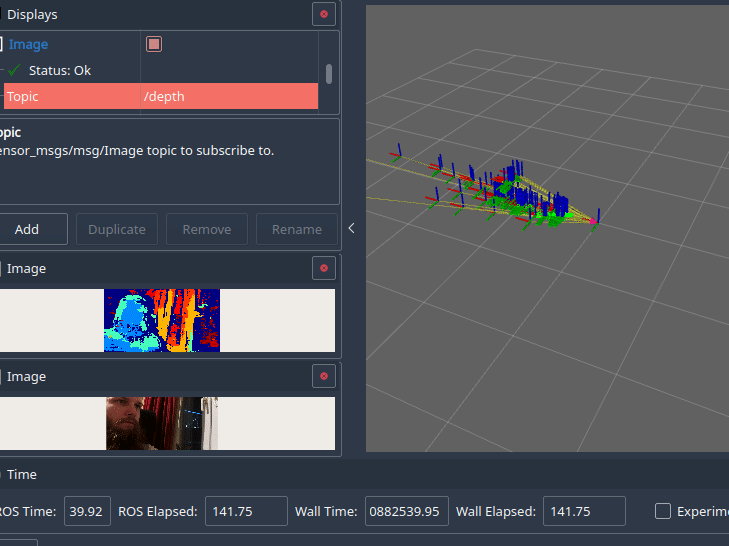

# An example-based DepthAI ROS2 driver

### You can find newer version of the driver at https://github.com/luxonis/depthai-ros

Work presented here has been developed by Adam Serafin while at Inmotion Labs

Hi! This is a simple (for now) project that enables Luxonis' DepthAI camera to work with ROS2 based systems.
In its basic form it provides depth, rgb, mono camera outputs, as well as recording .h264 streams.
For now, following examples can be run:
* Mobilenet detection example
* Segmentation example
* Multi camera launch 
* OAK 1 launch (it needs to set depth stream parameters to false)
* RGBD camera (pretty similar to how Realsense works)
* Rtabmap launch example
* Stella slam (former OpenVSLAM) example
Code was being tested on:
 - OAK-D lite camera on a x86 PC - ROS2 Galactic
 - OAK-D camera on a x86 PC - ROS2 Galactic
 - OAK-D camera on an ARM based system - Nvidia Jetson, using ROS2 Galactic built from source
 - OAK-D camera on Raspberry Pi using Ubuntu Core 22.04 and ROS2 Humble



## Known issues
- mobilenet & segmentation camera experiences lower frame rate than what is set.
- `description.launch.py` is currently only a dummy file, it should be replaced with a more concise urdf-based launch in the future. For now, you can edit it to get you camera links in a proper way.
- depth parameters are tuned for better accuracy, and depth stream itself might be lagging a little bit
- you should use best USB cable available

## Installation

### One line setup:
To just download the whole workspace, install dependencies and build the code, you can run:
**Note** This assumes that you have already installed specific ROS2 distro.
```
wget https://raw.githubusercontent.com/Serafadam/depthai_ros_driver/galactic/get_full_workspace.sh -O - | bash -s galactic
```

You can also specify which ROS2 distro this will downlad deps for, just change `bash -s galactic` to, for example `bash -s foxy`

When using the Remote Containers plugin, after the container builds, run `setup all` task from VSCode. This automatically pulls the `depthai-core` git submodule and uses rosdep to install all ROS dependencies.
If you want to install it outside of the container, check out `.vscode/tasks.json` for the exact commands used. You can build both `depthai-core` and `depthai-ros-driver` by using colcon in the base directory.
## Running
* To launch it together with rviz and a node that outputs the detections as TF frames and markers, `ros2 launch depthai_ros_driver mobilenet_camera.launch.py use_rviz:=True`

* In `multicamera.launch.py`, you can edit the file to provide mx_ids for specific cameras.
## SLAM
### Rtabmap
First install rtabmap_ros package `sudo apt install ros-distro-rtabmap-ros`
### Stella Slam (former OpenVSLAM)
Use `setup_stella_slam.sh` to install requirements (or follow the script manually). An example config file is provided in `config` directory

## Developing
If you want to develop a specific camera system, you should inherit the `BaseCamera` class. If you want to disable some streams, just set one of the respective base parameters to false.

## Parameters
Parameters are split into two groups, one with prefix `i_` and the other one with prefix `r_`
* `i_` parameters are set initially, and they cannot be changed without restarting the camera
* `r_` parameters can be changed at runtime, using for example RQT configuration tool
All of these parameters can also be overriden programatically, see `mobilenet_camera_obj` example.

List of parameters:
Base parameters:
 * i_usb_speed
 * i_max_q_size
 * i_enable_rgb
 * i_enable_depth
 * i_enable_lr
 * i_enable_imu
 * i_enable_recording
 * i_enable_logging
 * i_camera_mxid
 * i_camera_ip

RGB parameters:
* i_rgb_fps 
* i_preview_size 
* i_rgb_width
* i_rgb_resolution
* i_set_isp
* i_inverleaved 
* i_keep_preview_aspect_ratio
* r_set_man_focus
* r_man_focus
* r_set_man_exposure
* r_rgb_exposure
* r_rgb_iso
* r_set_man_whitebalance
* r_whitebalance

Stereo parameters:
* i_mono_fps
* i_mono_resolution
* i_align_depth
* i_lr_check
* i_lrc_threshold
* i_depth_filter_size
* i_stereo_depth_threshold
* i_subpixel
* i_extended_disp
* i_rectify_edge_fill_color
* i_enable_speckle_filter
* i_speckle_range
* i_enable_temporal_filter
* i_enable_spatial_filter
* i_hole_filling_radius
* i_spatial_filter_iterations
* i_threshold_filter_min_range
* i_threshold_filter_max_range
* i_decimation_factor


## Roadmap
 - Update topics - [x]
 - Make the Node Components - [x]
 - Add more example launch files to choose from, such as rgb-only or stereo only cameras - [x]
 - Reorganize the code - [x]
 - Add example how to use Camera Calibration - [x]
 - Visual Slam example - [x]
 - Add docker images - [x]
 - Add a script to get all camera ids [ ]
 - More configuration options [ ]
 - More examples:
   - Gaze estimation [ ]
   - Hand detection [ ]
   - Tracking [ ]
 - Separate publishing parameters [ ]
 - Refactor (as always)
